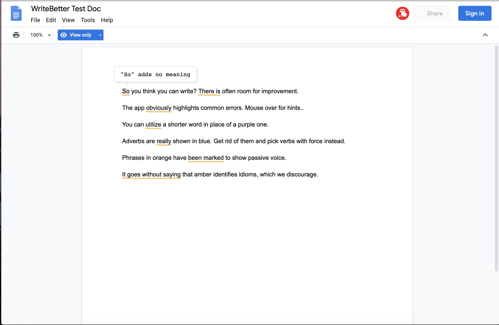

#  Write Better 

[](https://travis-ci.org/justiceo/write-better)

An English language grammar checker for Google docs. A.K.A the chrome extension port of [Btford's WriteGood](https://github.com/btford/write-good) which is a bundling of different naive English language linters. I checked for grammatical errors on this README using WriteBetter ;)



### Features
* **Works Offline**: It comes packaged with all the resources needed to parse text, generate and display suggestions on Google docs. No worries it's under 100Kb in size! See how to [inspect requests made by chrome extensions](https://www.howtogeek.com/302558/how-do-you-monitor-requests-made-by-a-google-chrome-extension/) if you're curious about what data extensions are sending or requesting.
* **Privacy First**: The texts of your Google docs are never uploaded to a remote server or stored locally. All analysis happen offline and on demand in the browser. See what [can go wrong when extensions make copies of your data](https://gizmodo.com/grammarly-bug-let-snoops-read-everything-you-wrote-onli-1822740378). 
* **Open Source**: You can browse [the code here](https://github.com/justiceo/write-better), [modify and build it yourself](#build-the-extension-locally). It is a stringing of existing open source language libraries. See the [list of libraries](https://github.com/btford/write-good#checks) used.
* **It's Free!**: Sorry I needed to include this given that it costs about $20 to get a pro paper review on services like Fiverr or Grammarly.


#### Not yet there:
* **Multi-Language Support**: Would allow users to run the checker on any language for which there is an open-source checker, like [Schrieb-gut](https://github.com/TimKam/schreib-gut) for German. 
* **Controlled Annoyance**: Grammar checkers always need to deal with false positive suggestions - it's the nature of English. Goal is to allow user to control confidence level of suggestions to display.
* **Other Writing Surfaces**: At the moment, the extension is [only activated](https://github.com/justiceo/write-better/blob/master/assets/manifest.json#L20) on https://docs.google.com. Generalizing it to other writing surfaces like email would require a bit more effort.


### Build the extension locally
```
# download the repo
git clone http://github.com/justiceo/write-better  
# install dependencies 
cd write-better && npm install  
# create an installable extension directory                    
gulp build
# create a release       
git checkout release
git rebase master
gulp clean
gulp build
zip -r extension.zip extension -x "*.DS_Store"
```

Extension directory would be in write-better/extension. See how to [load an unpacked extension](https://developer.chrome.com/extensions/getstarted#manifest) in chrome.


### Feedback
The only way I get feedback is when people complete this [anonymous form](https://forms.gle/LXBcvMG9Vt4fFUen8) or leave a review/comment on the extensions page. Please use them!